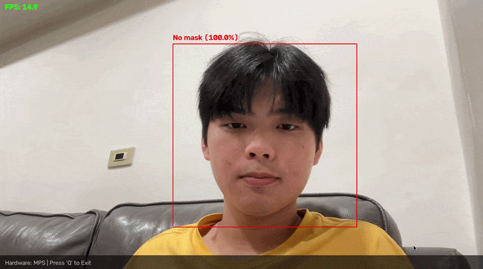

# Face Mask Classification

[](https://opensource.org/licenses/MIT)
[](https://www.python.org/downloads/)
[](https://pytorch.org/)
[](https://colab.research.google.com/drive/13fvln9eDDOxi-MM0HW2jN5qUhr39I9-N?usp=sharing)
[](https://jasonhoooooo-face-mask-classification.hf.space)

An end-to-end computer vision project implementing EfficientNet for face mask classification with real-time detection capabilities using MediaPipe BlazeFace.
This repository emphasizes fundamental AI concepts and software engineering best practices through a from-scratch implementation.

## Demo

**Real-time Detection**



**Gradio Web Interface**


## Features

- **4-Class Classification**: Detects the following mask-wearing states:
  - Mask on chin
  - Mask not covering nose
  - Mask properly worn
  - No mask
- **Curated Dataset**: Aggregated and cleaned from 4 Kaggle sources with 14,540 labeled images
- **EfficientNet Architecture**: PyTorch implementation of EfficientNet-B0 to B7 from scratch with compound scaling
- **Gradio Web Interface**: Lightweight inference endpoint for quick single-image mask classification
- **Real-time Detection**: Low-latency video stream evaluation with MediaPipe BlazeFace face detection pipeline

## Project Structure

```
face-mask-classification/
├── data/examples          # Example images
├── entrypoints/
│   ├── gradio_app.py      # Gradio web interface
│   └── realtime_app.py    # Real-time webcam detection
├── images/                # Demo images and GIFs
├── notebooks/
│   └── face_mask_classification_training.ipynb  # Colab notebook for training
├── src/
│   ├── __init__.py
│   ├── data_setup.py      # Data preparation utilities
│   ├── dataset.py         # Dataset class and data transforms
│   ├── model.py           # EfficientNet model architecture
│   └── train.py           # Training pipeline CLI
├── weights/               # Trained model weights
├── .gitignore             
├── LICENSE                # MIT License
├── README.md              # This file
└── requirements.txt       # Python dependencies
```

## Installation

1. Clone the repository:
```bash
git clone https://github.com/yourusername/face-mask-classification.git
cd face-mask-classification
```

2. Create a virtual environment (recommended):
```bash
python -m venv .venv
source .venv/bin/activate  # On Windows: .venv\Scripts\activate
```

3. Install dependencies:
```bash
pip install -r requirements.txt
```

## Usage

### Training the Model

Train the model using the CLI interface:

```bash
python src/train.py --dataset_root Face_Mask_Dataset \
                    --batch_size 32 \
                    --epochs 25 \
                    --learning_rate 1e-3 \
                    --model_name B1 \
                    --save_path weights/trained_model_parameters.pth
```

**Available Arguments:**
- `--dataset_root`: Path to dataset directory (default: `Face_Mask_Dataset`)
- `--batch_size`: Batch size for training (default: 32)
- `--epochs`: Number of training epochs (default: 25)
- `--learning_rate`: Learning rate for optimizer (default: 1e-3)
- `--model_name`: EfficientNet variant - B0 to B7 (default: B1)
- `--save_path`: Path to save trained model weights (default: `weights/trained_model_parameters.pth`)
- `--seed`: Random seed for reproducibility (default: 87)

**Note**: Training locally can be resource-intensive. If a local GPU is unavailable, you can use the Google Colab notebook:

[](https://colab.research.google.com/drive/13fvln9eDDOxi-MM0HW2jN5qUhr39I9-N?usp=sharing)

### Running the Web Interface

Launch the Gradio web app for interactive classification:

```bash
python entrypoints/gradio_app.py
```

The web interface will be available at `http://127.0.0.1:7860`

For quick inference with individual images, launch the Gradio app. This serves as a lightweight inference endpoint.

**Online Demo**: [](https://jasonhoooooo-face-mask-classification.hf.space)

### Real-time Detection

Launch the real-time webcam detection with MediaPipe face detector:

```bash
python entrypoints/realtime_app.py
```

To evaluate the model's performance on continuous video streams, use the real-time application. This script integrates a MediaPipe face detection pipeline with trained EfficientNet for low-latency predictions.

The application will:
- Open your webcam
- Detect faces using MediaPipe BlazeFace
- Classify mask status in real-time
- Display FPS and hardware device information
- Press 'Q' to exit

**Requirements**: Ensure you have a webcam connected and the MediaPipe model will be automatically downloaded on first run.

## Model Architecture

This project implements EfficientNet from scratch with the following components:

- **ConvBnSiLUBlock**: Standard convolution block with BatchNorm and SiLU activation
- **SEBlock**: Squeeze-and-Excitation block for channel-wise feature recalibration
- **MBConvBlock**: Mobile Inverted Bottleneck Convolution with optional residual connection
- **EfficientNet**: Main model with dynamic scaling (B0-B7 variants)

**Reference**: This implementation is based on the original EfficientNet paper by Mingxing Tan and Quoc V. Le (2019): [EfficientNet: Rethinking Model Scaling for Convolutional Neural Networks](https://arxiv.org/abs/1905.11946)

## Dataset

The model is trained on a face mask dataset aggregated and cleaned from multiple Kaggle sources:

- [Face Mask Detection](https://www.kaggle.com/datasets/vijaykumar1799/face-mask-detection)
- [Face Mask Detector](https://www.kaggle.com/datasets/spandanpatnaik09/face-mask-detectormask-not-mask-incorrect-mask)
- [Face Mask Dataset](https://www.kaggle.com/datasets/shiekhburhan/face-mask-dataset)
- [Face Mask Dataset TVT](https://www.kaggle.com/datasets/busrabetulcavusoglu/face-mask-dataset-tvt)

These datasets were manually integrated, classified, and cleaned to create the final training and test set. You can download the final dataset here: [Google Drive: Face_Mask_Dataset.zip](https://drive.google.com/file/d/1dbgt3_jVqyQ9uB3f59eZOGCVmSNd-Itj/view?usp=share_link)

**Directory Structure:**

```
Face_Mask_Dataset/
├── test/
│   ├── incorrect_mask_mc/
│   ├── incorrect_mask_mmc/
│   ├── with_mask/
│   └── without_mask/
└── train/
    ├── incorrect_mask_mc/
    ├── incorrect_mask_mmc/
    ├── with_mask/
    └── without_mask/
```

## License

This project is licensed under the MIT License - see the [LICENSE](LICENSE) file for details.
